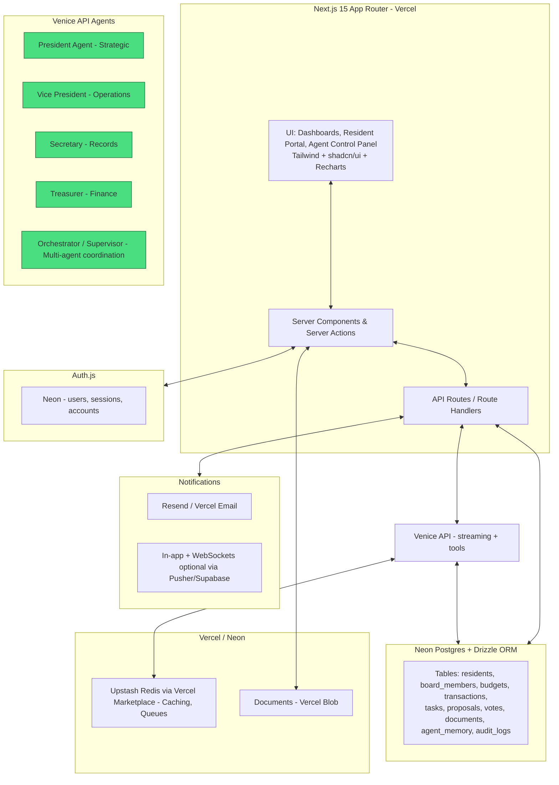

# HOA Management System - Project Context

## 1. High-Level Architecture (Mermaid Diagram)



Data flows: Residents submit issues → Agents analyze + draft → Human review/approve → Actions executed + logged. All agent actions are transparent and auditable.

## 2. Database Schema (Drizzle ORM)

Key tables (define in `src/db/schema.ts`):

```typescript
// Users & Roles
export const users = pgTable('users', {
  id: uuid('id').primaryKey().defaultRandom(),
  email: text('email').unique().notNull(),
  name: text('name'),
  role: text('role').$type<'resident' | 'board_president' | 'board_vp' | 'board_secretary' | 'board_treasurer' | 'admin'>(),
  // ... other fields
});

// boardMembers adds term tracking on top of the role field in users
export const boardMembers = pgTable('board_members', {
  id: uuid('id').primaryKey().defaultRandom(),
  userId: uuid('user_id').references(() => users.id).notNull(),
  termStart: date('term_start').notNull(),
  termEnd: date('term_end'),
  active: boolean('active').default(true),
});

// Core HOA Data
export const properties = pgTable('properties', { id, ownerId: uuid().references(() => users.id), address, ... });
export const budgets = pgTable('budgets', { id, fiscalYear, totalBudget, allocated, ... });
export const transactions = pgTable('transactions', { id, budgetId, amount, type: 'income'|'expense', description, date, approvedBy, agentId? });

// Tasks & Proposals
export const tasks = pgTable('tasks', {
  id: uuid().primaryKey(),
  title, description, status: 'pending'|'in_progress'|'awaiting_human'|'completed',
  assignedToUserId: uuid('assigned_to_user_id').references(() => users.id).nullable(),
  assignedToAgentRole: text('assigned_to_agent_role').nullable(), // 'treasurer' | 'president' | etc.
  agentThoughts: text('agent_thoughts'), // transparency
  createdByAgent: text(), // e.g., 'treasurer'
  completedBy: uuid(), // human who checked off
});

export const proposals = pgTable('proposals', { id, title, content, status, agentId, ... });

// votes is a separate table (not jsonb on proposals) — enables querying by voter, prevents data loss on proposal edits
export const votes = pgTable('votes', {
  id: uuid('id').primaryKey().defaultRandom(),
  proposalId: uuid('proposal_id').references(() => proposals.id).notNull(),
  voterId: uuid('voter_id').references(() => users.id).notNull(),
  vote: text('vote').$type<'yes' | 'no' | 'abstain'>().notNull(),
  castAt: timestamp('cast_at').defaultNow(),
});

// Agent Memory & Docs
export const agentMemory = pgTable('agent_memory', {
  id: uuid().primaryKey(),
  agentRole: text().notNull(), // 'president', etc.
  context: jsonb(), // persistent state, summaries
  lastUpdated: timestamp(),
});

export const documents = pgTable('documents', { id, title, fileUrl, category, uploadedBy, ... });

// Audit Logs
export const auditLogs = pgTable('audit_logs', { id, action, entityType, entityId, performedBy: text('performed_by'), // human or agent_role
  details: jsonb(), timestamp: timestamp().defaultNow() });
```

Use Drizzle relations for joins (e.g., tasks with proposals). Run migrations with drizzle-kit. Example query:

```typescript
// Example: Treasurer agent fetch
const budgetData = await db.query.budgets.findFirst({
  where: eq(budgets.fiscalYear, currentYear),
  with: { transactions: true }
});
```

## 3. Agent Architecture

**Implementation:** Each agent is a set of Server Actions / API routes that construct a prompt + tools, call Venice via Vercel AI SDK (streamText or generateText), parse output, and store results.

**State:** Persistent `agentMemory` table for long-lived context + short-term per-session conversation history in Upstash Redis. KV key schema: `agent:{role}:session:{sessionId}` with 1-hour TTL. Anything that must survive a server restart goes in the DB.

**Tools:** Custom function-calling via Venice (OpenAI-compatible). Tools include: `queryDatabase(sql)`, `generateProposal(type)`, `sendNotification()`, `createTask()`, `getResidentIssues()`.

**Multi-agent:** Supervisor (simple router) decides which agent(s) to invoke based on input. Use Vercel Workflow (WDK) for durable multi-step orchestration — it supports pause/resume and retries natively on Vercel serverless. Do not use LangGraph.js (requires persistent long-running process, incompatible with Vercel).

**Handoff:** Agent outputs structured JSON with `{ action, proposalDraft, needsHumanApproval: true, rationale }`. UI shows "Awaiting Human Action" cards. Human approves via Server Action that updates status and triggers next steps.

## 4. Prompt Engineering Strategy

Shared system prompt template (in `lib/agents/prompts.ts`):

```typescript
const baseSystem = `You are the [ROLE] Agent for Badger Creek Ranch HOA.
You are autonomous but transparent. Always reason step-by-step.
You have access to real HOA data via tools.
Human must approve all final actions. Output valid JSON for actions.
Prioritize cost-efficiency, accuracy, and community benefit.`;

const rolePrompts = {
  treasurer: `${baseSystem} Focus on financial analysis, forecasting, dues. Use data-driven insights.`,
  president: `${baseSystem} Strategic vision, high-level proposals.`,
  // etc.
};
```

Example agent call (Treasurer analyzing budget):

```typescript
// Venice is OpenAI-compatible — use createOpenAI, not a native venice() provider
import { createOpenAI } from '@ai-sdk/openai'
const veniceProvider = createOpenAI({
  baseURL: 'https://api.venice.ai/api/v1',
  apiKey: process.env.VENICE_API_KEY,
})

const result = await streamText({
  model: veniceProvider('llama-3.3-70b'), // see model guide in §8
  system: rolePrompts.treasurer,
  messages: [{ role: 'user', content: `Analyze current budget: ${JSON.stringify(budgetData)}` }],
  tools: /* tool definitions */,
});
```

Store agent thoughts in `tasks.agentThoughts` or `auditLogs` for full transparency. Use few-shot examples in prompts for consistent output formats. Test with temperature=0.3 for reliability.

## 5. Implementation Roadmap

**MVP (2-3 weeks):**
- Auth + RBAC.
- Basic resident portal + board dashboard.
- Database schema + Drizzle setup.
- Simple Treasurer + Secretary agents (read-only analysis + draft generation).
- Task & proposal basics with human approval.
- Audit logs.

**Phase 1 (4-6 weeks):** All 4 agents, full modules (budget, documents, voting), notifications, agent control panel.

**Phase 2 (4 weeks+):** Multi-agent coordination, advanced analytics (Recharts), payment integration, mobile responsiveness.

**Effort estimates:** Use TypeScript strict, Zod everywhere. Allocate 30% time for testing agent outputs and handoffs. Timeline above assumes a small team (2-3 devs). Solo developer should double each phase.

**Testing stack:** Vitest for unit tests (prompts, tools, schema validation). Playwright for E2E browser flows. Mock Venice calls in unit tests with `vi.mock`.

## 6. File/Folder Structure

```text
// Root of repo (src/ layout — pass --src-dir to create-next-app)
src/
  app/
    (auth)/...
    (board)/dashboard/page.tsx
    (board)/agents/[role]/page.tsx
    (resident)/portal/page.tsx
    api/
      agents/[role]/route.ts     // trigger agent
      tasks/[id]/approve/route.ts
      webhooks/venice/route.ts   // optional
  lib/
    agents/                      // prompts, tools, orchestrator
    venice.ts                    // createOpenAI Venice client
  db/
    schema.ts                    // Drizzle table definitions
    index.ts                     // db connection (drizzle(pool))
  components/
    ui/                          // shadcn
    AgentCard.tsx
    ProposalReview.tsx
  middleware.ts                  // Auth.js route protection — protects (board)/* and api/agents/*

// Project root (not inside src/)
drizzle.config.ts                // points to src/db/schema.ts, DATABASE_URL
.env.local                       // see §8 for required vars
```

## 7. Security & Compliance

- RBAC via Auth.js + middleware.
- Row-level security in Neon where possible; server-side checks otherwise.
- Encrypt sensitive fields; audit all agent + human actions.
- GDPR/HOA compliance: consent for data, export/delete options.
- Rate limiting on Venice calls; input sanitization with Zod.
- Never expose raw DB queries to agents without validation.

## 8. Integration Points

- **Venice:** Use `@ai-sdk/openai` with Venice base URL (see §4). VENICE_API_KEY in Vercel env. Model guide:
  - Routine analysis / summarization: `llama-3.3-70b` (fast, cheap)
  - Complex proposals / reasoning: `qwen-2.5-vl` or `deepseek-r1-671b`
  - Agent scratchpad / chain-of-thought: `llama-3.1-405b`
  Check `https://api.venice.ai/api/v1/models` for current model list.
- **Email:** Resend for notifications. `RESEND_API_KEY` required.
- **Payments:** Future Stripe webhooks.
- **Docs:** Upload to Vercel Blob (`@vercel/blob`). Use `put()` server-side, return signed URLs for client access. `BLOB_READ_WRITE_TOKEN` required. Store returned URL in `documents.fileUrl`.

**Required `.env.local` vars:**
```
DATABASE_URL=           # Neon connection string (pooled)
DATABASE_URL_UNPOOLED=  # Neon direct (for drizzle-kit migrations)
AUTH_SECRET=            # openssl rand -base64 32
AUTH_URL=               # http://localhost:3000 in dev
VENICE_API_KEY=
RESEND_API_KEY=
BLOB_READ_WRITE_TOKEN=
UPSTASH_REDIS_REST_URL=
UPSTASH_REDIS_REST_TOKEN=
```

**Drizzle config** (`drizzle.config.ts`):
```typescript
import { defineConfig } from 'drizzle-kit'
export default defineConfig({
  schema: './src/db/schema.ts',
  out: './drizzle',
  dialect: 'postgresql',
  dbCredentials: { url: process.env.DATABASE_URL_UNPOOLED! },
})
```
Dev: `drizzle-kit push` (schema push, no migration files). Prod: `drizzle-kit migrate` (generates SQL migration files, run in deploy hook).

## 9. UI/UX Recommendations

Modern, clean, professional with Tailwind + shadcn (cards, tables, modals). Dark mode default. Sidebar navigation for board vs resident views. Agent activity feed with expandable "Thoughts" sections. Color-coded status (green=approved, amber=awaiting human). Mobile-first responsive.

## 10. Deployment & DevOps

- **Vercel:** Connect GitHub repo, env vars (DB_URL, VENICE_KEY, AUTH_SECRET, etc.). Use preview deployments.
- **Neon:** Branching for dev/prod.
- **CI/CD:** Vercel automatic + Drizzle migrations on deploy.
- **Monitoring:** Vercel Analytics + Sentry for errors.

## 11. Future Extensibility

- Mobile: React Native or PWA with Expo.
- Payments: Stripe for dues.
- Doc signing: HelloSign/DocuSign integration.
- Advanced agents: RAG over all documents, image analysis for maintenance photos.
- Extensible tool system via MCP for new capabilities.

## Additional Actionable Advice

**Agent-Handoff Workflow:** Agent → Store draft in DB with status: 'awaiting_human' → UI polls/notifies → Human Server Action calls approveTask(id, notes) → Triggers next agent step or notification.

**Cost Control:** Cache frequent queries in KV; batch agent runs; use structured outputs to minimize tokens.

**Testing:** Unit test prompts/tools; integration test end-to-end flows with mock Venice responses.

**Start Here:**
```bash
npx create-next-app@latest hoa --app --typescript --tailwind --src-dir --import-alias "@/*"
cd hoa
npx shadcn@latest init
npm install drizzle-orm @neondatabase/serverless drizzle-kit
npm install next-auth@beta  # Auth.js v5
npm install @ai-sdk/openai ai
npm install @upstash/redis @vercel/blob resend zod
```
